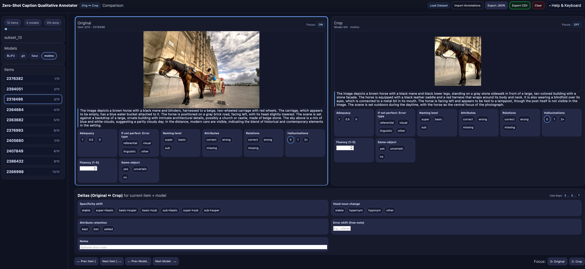

# Qualitative Analysis of Zero-Shot Caption Generation
  
Vision-language models (VLMs) generate fluent captions, but their robustness under limited visual context is unclear. We compare BLIP-2, GIT, LLaVA, and Molmo on the ManyNames dataset using original and cropped images. Captions are produced zero-shot (no fine-tuning or prompting) and evaluated by human annotators for adequacy, specificity, attributes, relations, hallucinations, fluency, and cross-view consistency. Cropping generally improves accuracy by reducing distractors. GIT is robust and object-centric, but has a lot of OCR hallucination. BLIP-2 is concise but prone to color/object hallucinations. LLaVA offers rich scene narratives with occasional referential drift. Molmo gives fine-grained detail yet raises adequacy risk. Findings show architecture and training drive context sensitivity, motivating crop-aware, hallucination-resistant captioning.


## Installation  

Create a new conda environment and install the dependencies:  

```cmd
conda create -n vlm python=3.9 -y
conda activate vlm
```

### Required packages  

```cmd
pip install torch torchvision torchaudio --index-url https://download.pytorch.org/whl/cu128
pip install pandas transformers matplotlib wordcloud python-opencv
```

---

## Prepare Caption Data  

1. Download the **Visual Genome** dataset.  
2. Unzip and move it into a dedicated folder.  
3. Download the **ManyNames** `.tsv` [file](https://github.com/amore-upf/manynames/blob/master/manynames-en.tsv).  

---

## Create Cropped Images + Generate Captions  

Run the following command to crop images and generate captions with different VLMs:  

```cmd
python generate_caption.py
    --vlm "BLIP2" "llava" "git" "molmo" 
    --crop_images True 
    --csv manynames-en.tsv 
    --images images 
    --captions_dir captions
```

---

## Prepare Evaluation Data  

Build a subset dataset for evaluation:  

```cmd
 python build_subset_dataset.py \
      --images-dir ./images \
      --models-glob "./captions/*.pkl" \
      --out-dir subset_30 \
      --dataset-json dataset_subset.json
      --n 30
```

This will generate a file: [`dataset_subset_30.json`](dataset_subset_30.json).  

---

## Run Evaluation  

1. Start a simple Python HTTP server:  

   ```cmd
   python -m http.server 8080
   ```

2. Open [http://localhost:8080/](http://localhost:8080/) in your browser.  
3. Upload the generated [`dataset_subset_30.json`](dataset_subset_30.json) under **Load Dataset**.  
4. Evaluate the model and export the results.  


